# Capstone_Project
# 🧬 Integrative Analysis of Breast Cancer Outcomes Using Machine Learning

**Term:** Spring 2025  
**Team:** Purple (Meghana Bodduluri, Sanjana Kanneganti, Sowmya Bathula, Swetha Nunemunthala)  
**Keywords:** Python, pandas, scikit-learn, TensorFlow, SHAP, Gradio  

---
## 📖 Project Overview:

Breast cancer is one of the most common cancers among women worldwide. Early detection and personalized treatment planning are critical for improving patient outcomes.
This project analyzes breast cancer patient data to predict survival, treatment response, and infection risk using gene expression and clinical datasets (GSE datasets). The focus is on deriving actionable insights from complex biomedical data to support clinical decision-making.

In this project, we used gene expression and clinical datasets (GSE25066 & GSE19783 from NCBI GEO) to predict:
 
- Survival outcomes
  
- Treatment response
  
- Infection risk
We implemented Machine Learning (Random Forest) and Deep Learning (Neural Networks) models, applied SHAP explainability to identify genetic key features most associated with patient outcomes and deployed an interactive Gradio interface for real-time predictions. 

---

## 🔹 Objectives
- Predict survival, treatment response, and infection risk from high-dimensional gene expression data.  
- Compare the performance of **Random Forest** and **Neural Network** models.  
- Use SHAP values to identify important genetic features.  
- Deploy an interactive Gradio app for real-time predictions.

---

### 🛠️ Technical Design

Languages: Python

Data Handling: pandas, numpy, GEOparse

ML/DL Models: scikit-learn (Random Forest), TensorFlow/Keras (Neural Networks)

Explainability: SHAP

Visualization: matplotlib, seaborn

Interface: Gradio

Version Control: GitHub

---

## 🔹 Approach
## 1.Data Source 
The analysis depends on two distinct datasets.
* **GSE25066**: Which has gene expression profiles for breast cancer patients and is employed to predict survival outcomes and treatment responses.
* **GSE19783**:* Which provides gene expression data prominent to infection risk.
* Datasets were downloaded from the NCBI GEO repository in compressed format and converted to CSV for analysis.

## 2. Data Preprocessing
**Steps performed:**  

* **Data Retrieval:**  
  Downloaded and extracted datasets using GEOparse, then converted them to structured CSV files.  
  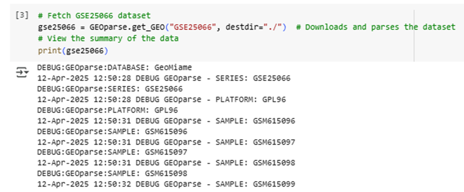  

* **Data Cleaning:**  
  Selected only relevant gene expression columns (GSM) and added a `Probe_Category` column.  
  Proxy labels for **Survival_Outcome, Treatment_Outcome, and Infection_Outcome** were created using KMeans clustering.  

* **Normalization & Splitting:**  
  Standardized the gene expression data using `StandardScaler` (mean=0, std=1). Split datasets 80% for training and 20% for testing.  
    

* **Challenges:**  
  - Proxy outcomes may not fully match clinical labels, introducing noise.  
  - Infection dataset had fewer features (115 vs 508), limiting model predictions.  

---

## 3. Exploratory Data Analysis (EDA)

**i. Mean Survival and Infection Outcome**  
Non-survivors had higher mean gene expression (~9.5) vs survivors (~6.0). High infection risk patients also showed higher expression (~11 vs 7).  
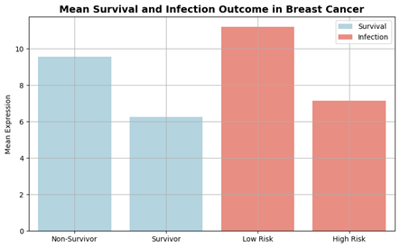  

**ii. Mean Expression Across GSM Columns**  
Distinct expression patterns observed between survivors and non-survivors.  
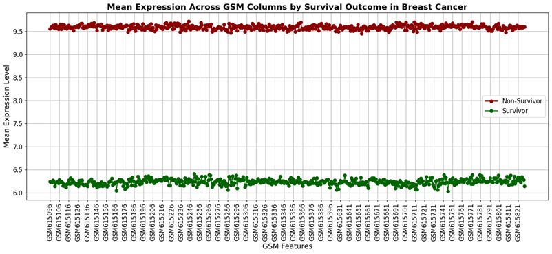  

**iii. GSM Expression by Infection Outcome**  
Clear clustering of low-risk (blue) and high-risk (red) patients.  
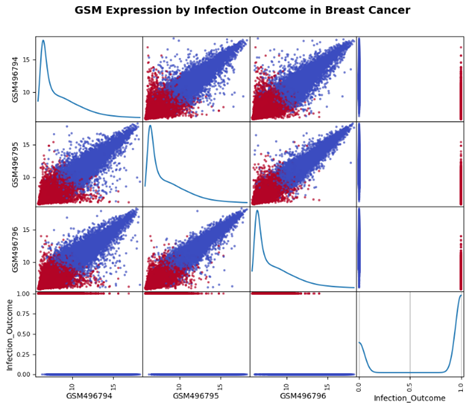  

**iv. Density of Survival & Infection**  
Dataset-specific expression distributions highlighted differences between survival and infection datasets.  
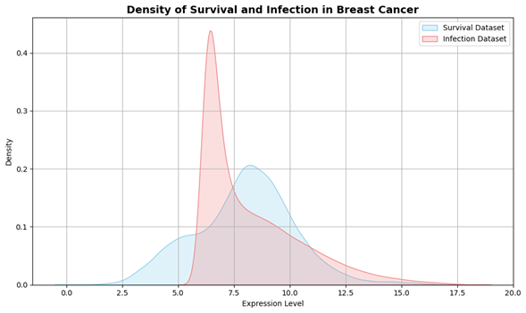  

**v. Correlation Heatmap of GSM Features**  
High correlation among first 5 GSM features, indicating redundancy.  
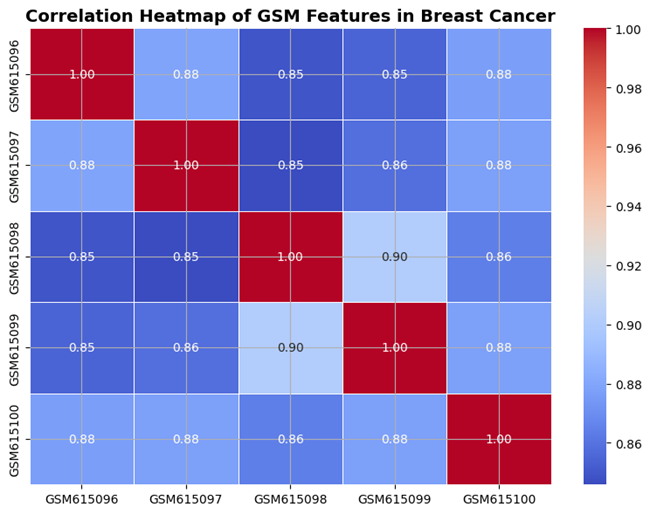  

**vi. GSM615096 vs GSM615097 Scatter Plot**  
Shows strong predictive potential for survival outcomes.  
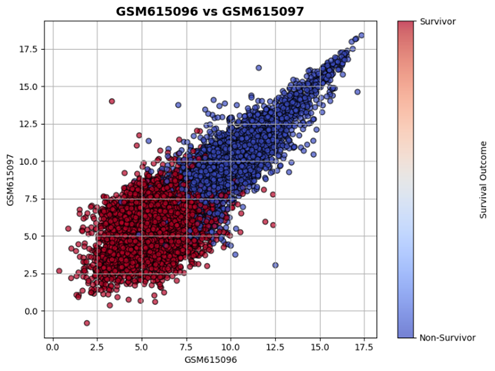  

---

## 4. Model Development & Evaluation

**Random Forest (RF) Models**  
- Trained for survival, treatment, and infection outcomes.  
- Hyperparameters: `n_estimators=50`, `max_depth=10`.  
- Saved models: `rf_survival_model.joblib`, `rf_treatment_model.joblib`, `rf_infection_model.joblib`.  

**Neural Network (NN) Models**  
- Architecture: Dense(64) → Dropout(0.2) → Dense(32) → Dense(1, sigmoid)  
- Optimizer: Adam, Loss: Binary Crossentropy  
- Epochs: 20, Validation split: 20%  
- Saved models: `nn_survival_model.h5`, `nn_treatment_model.h5`, `nn_infection_model.h5`.  

**Performance Highlights**  

- **Random Forest:**  
  - Survival: 98.41% accuracy, AUC 0.9991  
  - Treatment: 98.07% accuracy, AUC 0.9988  
  - Infection: 99.39% accuracy, AUC 0.9998  
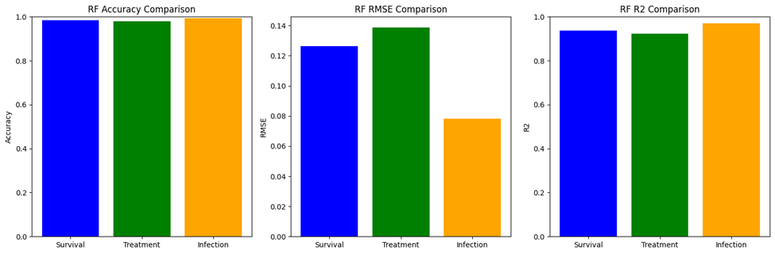  

 **Neural Network Loss & NN Accuracy Curves**  
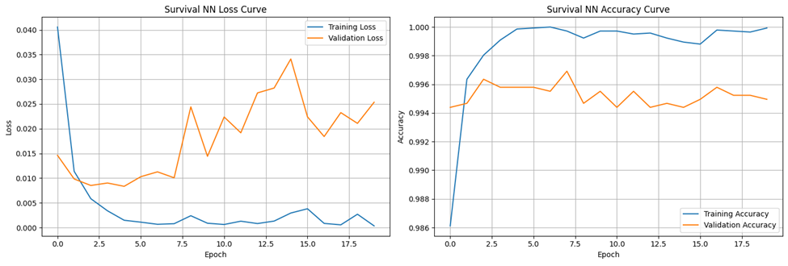  
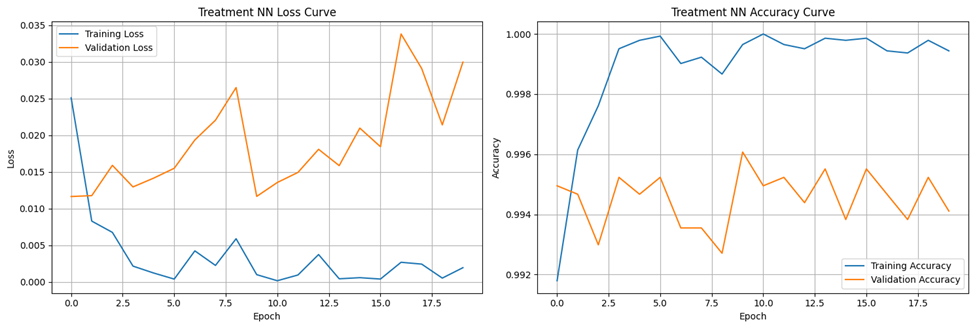  
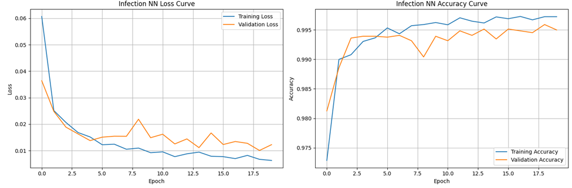  

**NN Performance Comparison**  
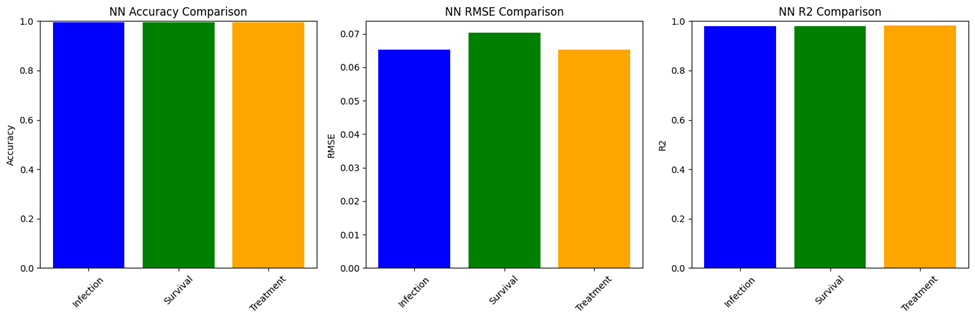  

**ROC Curves (Random Forest)**  
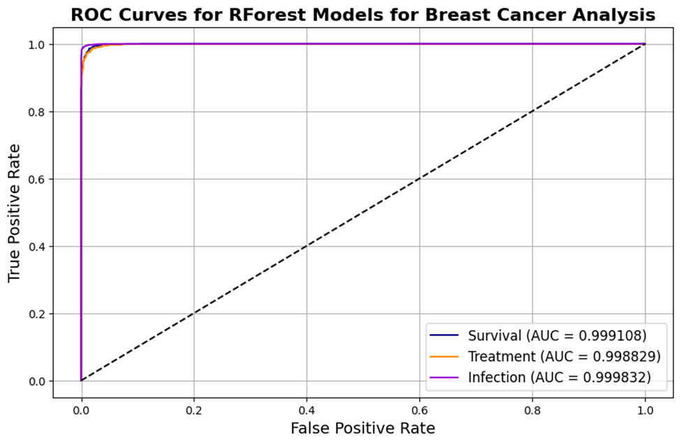  

**Model Comparison**  
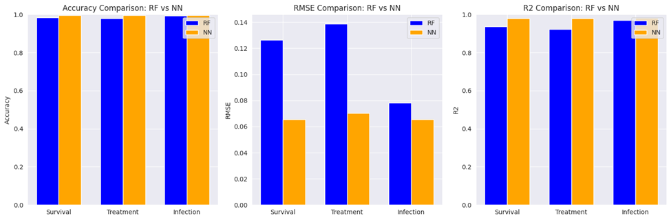  

**SHAP Feature Importance (Survival Outcome)**  
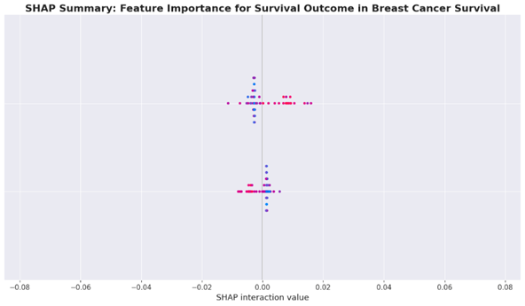  

---

## 5. Gradio Deployment
Interactive interface to predict outcomes using five gene inputs (GSM615096–GSM615100).  
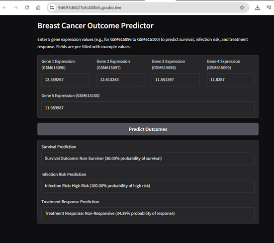  

---

## 6. Key Findings
- RF models outperformed NN, with infection risk achieving **99.39% accuracy**.  
- SHAP analysis confirmed critical gene features for survival predictions.  
- EDA validated that survivors have higher gene expression patterns.  
- Gradio interface provides real-time predictions but is limited to five features.  

---

## 7. Recommendations / Future Work
- Use real clinical labels instead of proxy outcomes.  
- Expand infection dataset for better predictions.  
- Optimize NN architecture and reduce overfitting.  
- Extend Gradio to accept full feature set.  
- Validate models on external datasets.  

---

## 8. Conclusion
Random Forest and Neural Network models successfully predicted breast cancer outcomes, with RF models showing **superior performance**. This project highlights how **AI and explainable ML** can assist clinicians in personalized treatment planning.  

---

## 🔹 Results
- Random Forest consistently outperformed Neural Networks.  
- Infection risk model achieved **99.39% accuracy with near-perfect AUC**.  
- SHAP results aligned with clinical insights, making predictions interpretable.  
- The Gradio app provides real-time predictions, demonstrating potential for clinical decision support.

---

## 🔹 My Contribution (Meghana Bodduluri)
- Retrieved and preprocessed GEO datasets into structured formats.  
- Conducted **EDA**, visualizations, and correlation analysis(survival trends, heatmaps, scatter plots).
- Implemented and tuned **Random Forest models**.  
- Applied **SHAP explainability** to identify predictive features.  
- Assisted with **Gradio deployment** for interactive model use.

---

 

   
     
